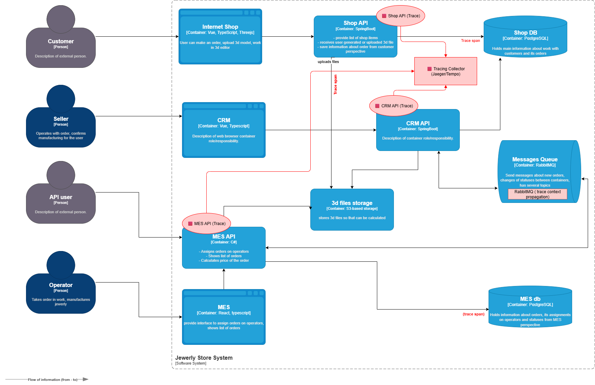

#  Внедрение распределённого трейсинга заказов в системе «Александрит»

## 1. Мотивация

Команда регулярно сталкивается с ситуациями, когда:

- заказы находятся в «подвешенном» состоянии или зависают на определённом этапе обработки;
- сообщения теряются при передаче между сервисами через RabbitMQ;
- поддержка не может оперативно определить, в каком сервисе произошёл сбой;
- инциденты устраняются долго, а клиенты и партнёры теряют доверие.

Внедрение распределённого трейсинга позволит:

-  отслеживать заказ по всей цепочке обработки (от создания до доставки);
-  сократить время поиска причин сбоев;
-  повысить прозрачность и качество работы API и очередей;
-  упростить диагностику как для разработчиков, так и для поддержки;
-  использовать трейсинг как дополнение к мониторингу.

###  Метрики, на которые повлияет внедрение трейсинга

| Тип | Метрика | Эффект |
|-----|---------|--------|
| Бизнес | MTTR (среднее время устранения инцидента) |  Уменьшение за счёт быстрой локализации |
| Бизнес | Доля просроченных заказов | Сокращение за счёт ускорения реакции |
| Техническая | Время прохождения заказа по цепочке | Повышение прозрачности |
| Техническая | Количество “зависших” заказов | Снижение за счёт проактивного реагирования |
| Техническая | SLA по API и очередям | Улучшение благодаря выявлению узких мест |

---

## 2.  Точки, где заказ может «сломаться» или зависнуть

Анализ архитектуры показал следующие критические места цепочки:

- Shop API → RabbitMQ → CRM API → RabbitMQ → MES API
- Последовательность статусов заказа:

INITIATED → FILE_UPLOADED → SUBMITTED → PRICE_CALCULATED →
MANUFACTURING_APPROVED → MANUFACTURING_STARTED →
MANUFACTURING_COMPLETED → PACKAGING → SHIPPED → CLOSED

###  Основные критические точки для внедрения трейсинга:

| Этап | Возможная проблема |
|------|---------------------|
| Shop API | Заказ не попал в очередь RabbitMQ |
| RabbitMQ (Shop → CRM) | Потеря или задержка сообщения |
| CRM API | Ошибка при подтверждении, зависание |
| RabbitMQ (CRM → MES) | Потеря или задержка |
| MES API | Длительная обработка, сбой расчёта стоимости |
| MES API → RabbitMQ → CRM API | Сообщение о завершении не доставлено |
| CRM API → фронтенд / партнёр | Статус не обновился |
| MES Dashboard | Задержки обновления статуса |

---

## 3.  Данные, которые должны попадать в трейсинг

| Категория | Поле | Назначение |
|-----------|------|------------|
| Заказ | `order_id` | Уникальный идентификатор заказа |
| Пользователь | `customer_id` | Фильтрация по клиентам |
| Контекст | `trace_id`, `span_id` | Связь событий между сервисами |
| Время | `timestamp_start`, `timestamp_end` | Анализ задержек |
| Метаданные | `service_name`, `operation_name` | Идентификация участка цепочки |
| Ошибки | `error_code`, `error_message` | Диагностика причин |
| Состояние | `order_status` | Статус на момент события |
| Транспорт | `queue_name`, `correlation_id` | Диагностика очередей |
| Время обработки | `duration_ms` | Определение узких мест |

---

## 4.  Предлагаемое решение

###  Технологии

- OpenTelemetry — агент для сбора трейсов в API-сервисах и при работе с очередями.  
- Jaeger или Tempo — бекенд для хранения и анализа трейсов.  
- Grafana — визуализация трейсингов и корреляция с метриками.  
- Интеграция через SDK для Java (Spring Boot), C#, RabbitMQ interceptors.

###  Внедрение по компонентам

| Компонент | Доработка |
|-----------|-----------|
| Shop API | Добавление OpenTelemetry SDK, генерация trace_id, трейсинг вызовов к S3 и БД |
| RabbitMQ | Проксирование `trace_id` и `correlation_id` в headers |
| CRM API | Добавление SDK, спаны на всех этапах обработки заказов |
| MES API | Добавление SDK, спаны на этапах расчётов и производственных процессов |
| PostgreSQL и S3 | Трейсинг через агенты API (дополнительные spans), без отдельных агентов |
| Observability Layer | Развёртывание Jaeger/Tempo, интеграция с Grafana |
| CI/CD | Подключение агентов трейсинга в окружениях |

---

## 5.  Доработка C4-диаграммы

\

---

## 6.  Компромиссы и ограничения

| Сценарий | Проблема | Возможное решение |
|----------|----------|--------------------|
| Проприетарные части MES | Сложно внедрить SDK | Оборачивание точек входа и очередей |
| Высокая нагрузка | Дополнительный overhead | Сэмплирование трейсов |
| Старые сервисы | Нет поддержки контекста | Частичная трассировка через ID |
| Внешние партнёры | Нет trace_id в API | Корреляция по `order_id` и `correlation_id` |

---

## 7.  Аспекты безопасности

- **Аутентификация и авторизация**  
Доступ к Jaeger/Grafana — только у сотрудников с ролями `DevOps`, `Разработчик`, `Поддержка`.

- **Ролевая модель**  
- Поддержка видит данные заказов без чувствительных данных.  
- Разработчики видят технические данные.

- **Шифрование и защита данных**  
- TLS для всех соединений между агентами и коллектором.  
- Проверка подлинности `trace_id`.

- **Логирование и контроль доступа**  
- Все входы в систему трейсинга фиксируются.  
- Регулярные ревью прав.

- **Retention**  
- Хранение трейсов ограничено по времени (14 дней).  
- Автоматическое удаление старых данных.

---

## 8.  План внедрения трейсинга

1.  Развернуть Jaeger и Grafana.  
2.  Добавить OpenTelemetry SDK в **Shop API**, **CRM API**, **MES API**.  
3.  Добавить прокидывание `trace_id` и `correlation_id` в RabbitMQ.  
4.  Определить базовые спаны по ключевым бизнес-этапам заказа.  
5.  Протестировать решение на dev-окружении.  
6.  Включить на проде с сэмплированием.  
7.  Настроить дашборды и алерты в Grafana.

---

## 9. Ожидаемые результаты

- Поддержка сможет быстро определить где и почему заказ завис.  
- DevOps и разработчики получат инструмент анализа производительности и потерь сообщений.  
- SLA улучшится за счёт ускорения реакции.  
- Время расследования инцидентов сократится в разы.  
- Появится прозрачность всей цепочки обработки заказов.

