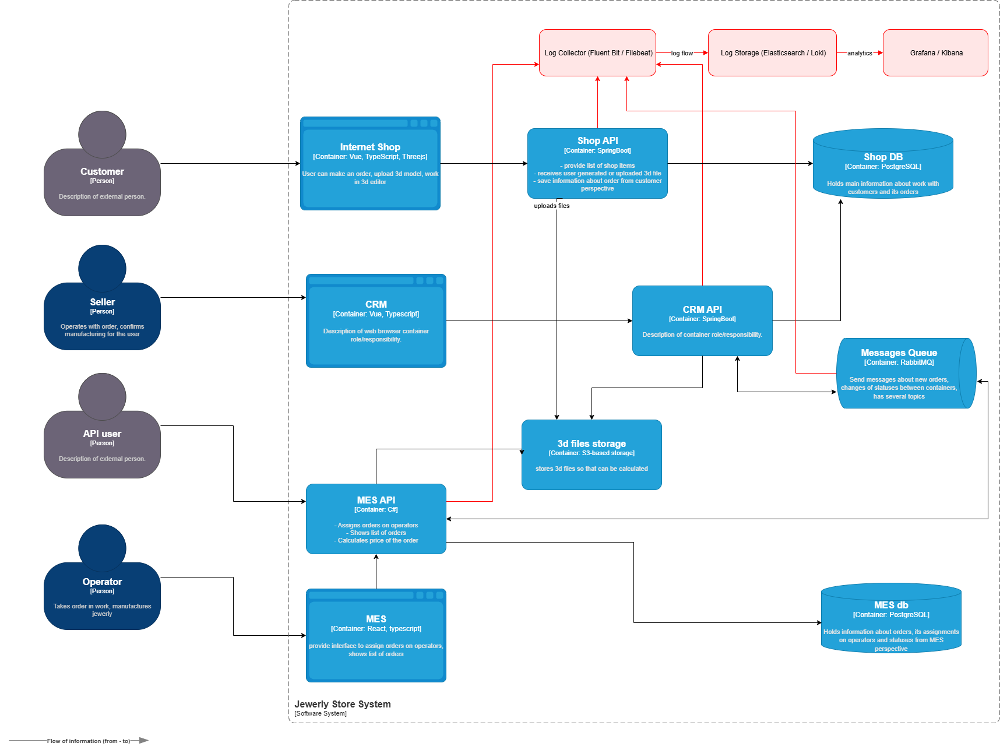

#  Внедрение централизованного логирования в системе «Александрит»

## 1. Мотивация

На текущий момент инциденты с заказами часто расследуются вручную, что:

-  занимает много времени (логи хранятся на отдельных серверах или вообще отсутствуют);
-  не даёт прозрачной картины — невозможно быстро отследить, где именно произошёл сбой;
-  не позволяет эффективно выявлять аномалии в реальном времени;
-  требует ручной корреляции событий между сервисами.

Внедрение централизованного логирования позволит:

-  оперативно находить ошибки и инциденты в цепочке заказов;
-  анализировать нагрузку и нештатные сценарии;
-  выявлять аномалии и DDoS-атаки;
-  повысить прозрачность бизнес-процессов и взаимодействия систем.

### Метрики, на которые повлияет внедрение логирования

| Тип | Метрика | Эффект |
|-----|---------|--------|
| Бизнес | MTTR (время устранения инцидента) |  Сокращение за счёт ускорения диагностики |
| Бизнес | SLA API |  Повышение за счёт предсказуемости отказов |
| Техническая | Время реакции на инцидент |  Ускорение через централизованные логи |
| Техническая | Количество необработанных заказов |  Снижение за счёт быстрой локализации |
| Техническая | Уровень информационной безопасности |  Улучшение за счёт алертов и аномалий |

---

## 2. Системы, из которых требуется сбор логов

Анализ архитектуры показал, что наиболее критичны для логирования следующие узлы:

| Система | Причина |
|---------|---------|
| Shop API | Источник заказов, ошибки и задержки напрямую влияют на клиентов |
| CRM API | Управление заказами, статусы, подтверждения |
| MES API | Производственный блок, ключевой узел расчётов |
| RabbitMQ | Потери сообщений, задержки, проблемы с доставкой |
| Базы данных | Ошибки транзакций, таймауты, деградация производительности |
| S3 | Проблемы с загрузкой 3D-файлов, влияющие на расчёты MES |

 **Логирование в первую очередь нужно внедрить в API-контейнерах**, RabbitMQ и S3/БД — как поддерживающих узлах.

 Логи непосредственно с фронтовых приложений (SHOP, CRM, MES) не требуются в операционной системе логирования, так как:
- бизнес-события фиксируются на уровне API;
- фронт не является источником «истинных» событий;
- сбор таких логов создаёт лишнюю нагрузку и дублирование данных;
- для UI-аналитики используются отдельные инструменты (Sentry, RUM, аналитика).

---

## 3.  Список логов уровня INFO

| Событие | Содержание лога | Дополнительные поля |
|---------|-----------------|----------------------|
| Создание заказа | Время, заказ, клиент | `order_id`, `customer_id`, `timestamp` |
| Изменение статуса заказа | Старый/новый статус | `order_id`, `old_status`, `new_status`, `service_name` |
| Получение/отправка сообщения в очередь | Queue name, trace_id | `queue_name`, `order_id`, `trace_id` |
| Расчёт стоимости | Старт/завершение | `order_id`, `calculation_time_ms` |
| Ошибки взаимодействия с S3 | Таймаут, размер файла | `file_size`, `duration_ms`, `order_id` |
| Ошибки взаимодействия с БД | Тип операции, время | `query_type`, `duration_ms`, `trace_id` |
| Авторизация/аутентификация | Успех/неуспех | `user_id`, `ip_address`, `method` |
| Обработка API-запросов | Вход/выход, время ответа | `path`, `status_code`, `duration_ms` |

---

## 4.  Другие уровни логирования

| Уровень | Когда использовать | Примеры |
|---------|---------------------|---------|
| DEBUG | Диагностика в dev/release | Детальные шаги расчётов MES, внутренние переменные |
| INFO | Нормальные бизнес-события | Статусы, API-вызовы, обработка заказов |
| WARN | Некритичные проблемы | Медленные запросы, ретраи, частичные ошибки |
| ERROR | Критичные ошибки | Потеря сообщения, фейл запроса в БД |
| FATAL | Фатальные сбои | Падение сервиса или неотловленные исключения |

---

## 5.  Приоритет внедрения трейсинга и логирования

Так как невозможно внедрить всё одновременно, логирование и трейсинг в первую очередь настраиваются для:

| Система | Почему в приоритете |
|---------|----------------------|
| Shop API | Входная точка системы, источник заказов |
| CRM API | Управление статусами и маршрутизация |
| MES API | Долгие операции, критическая бизнес-логика |
| RabbitMQ | Частые инциденты, сложно отлаживать без логов |

 Вторым этапом — базы данных и S3 (как вспомогательные системы).

---

## 6. Предлагаемое решение

###  Технологии

- OpenTelemetry Logging Exporter или стандартные SDK для API.  
- Fluent Bit / Filebeat — сбор логов.  
- Elasticsearch — централизованное хранилище.  
- Grafana Loki — альтернатива Elasticsearch (менее ресурсоёмкая).  
- Kibana / Grafana — визуализация и поиск.

###  Изменения в архитектуре

-  Добавлен Log Collector (Fluent Bit/Filebeat).  
-  Настроен сбор логов с Shop API, CRM API, MES API.  
-  Подключение брокера RabbitMQ для логов доставки сообщений.  
-  Центральное хранилище логов (Elasticsearch или Loki).  
-  Дашборды для анализа логов и алертов.

\

---

## 7.  Политика безопасности

| Область | Меры |
|---------|-------|
| Доступ | Только DevOps, поддержка, разработчики через RBAC |
| Чувствительные данные | Маскирование `customer_id`, `ip_address` и персональных данных |
| Транспорт | TLS между агентами и хранилищем |
| Аудит | Все действия в системе логирования логируются |
| Retention | Ограничение срока хранения (например, 30 дней для INFO, 7 дней для DEBUG) |

---

## 8.  Политика хранения логов

-  Отдельные индексы по системам: Shop API, CRM API, MES API, RabbitMQ.  
-  Срок хранения: INFO — 30 дней, ERROR/FATAL — 90 дней, DEBUG — 7 дней.  
-  Размер хранения контролируется через ретеншн-политику и автоматическое удаление старых логов.  
-  Архивирование при необходимости для долгосрочного анализа.

---

## 9. Аналитика и алертинг

| Направление | Что делаем |
|-------------|-----------|
| Алертинг | Настраиваем правила в Grafana/Kibana — превышение количества ошибок, задержки |
| Аномалии | Поиск всплесков событий: резкое увеличение заказов, ошибок, таймаутов |
| Корреляция | Связь логов с трейсингом по `trace_id` и `order_id` |
| DDoS | Детект аномальных пиков входящих запросов на Shop API |

---

## 10. Критерии выбора технологии логирования

| Критерий | Elasticsearch | Grafana Loki |
|----------|---------------|--------------|
| Масштабируемость | Высокая, но ресурсоёмкая | Лёгкая, проще в поддержке |
| Полнотекстовый поиск | Отличный | Ограниченный |
| Интеграция с мониторингом | Хорошая | Отличная (в паре с Grafana) |
| Стоимость | Высокая | Ниже |
| Производительность | Высокая при достаточных ресурсах | Оптимальна для средних нагрузок |
| Обучаемость команды | Требует навыков | Проще для DevOps |

 **Рекомендация:**  
- для старта и пилота — Loki + Grafana (минимальные затраты, быстрая интеграция),  
- для масштабирования — Elasticsearch.

---

## Результат внедрения

- Централизованные логи из ключевых API и очередей;  
- Ускорение расследования инцидентов;  
- Возможность построения дашбордов и алертов;  
- Улучшение SLA за счёт превентивного реагирования;  
- Повышение прозрачности и управляемости архитектуры.
"""
