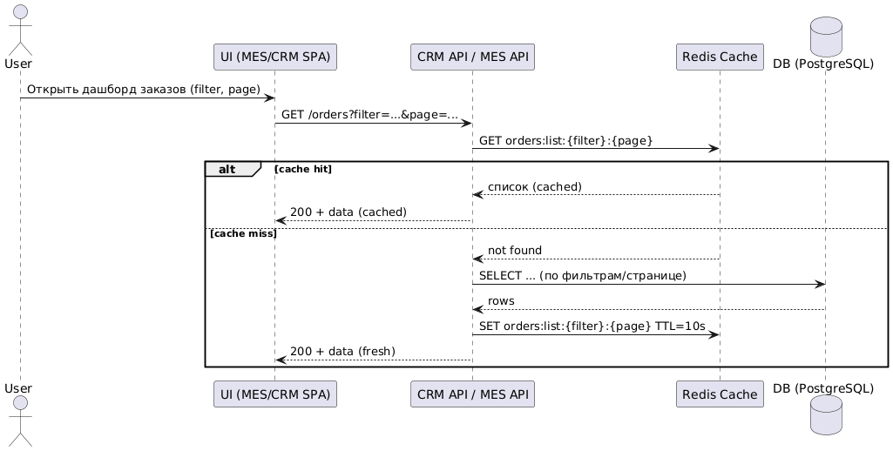
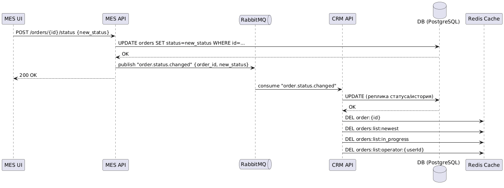
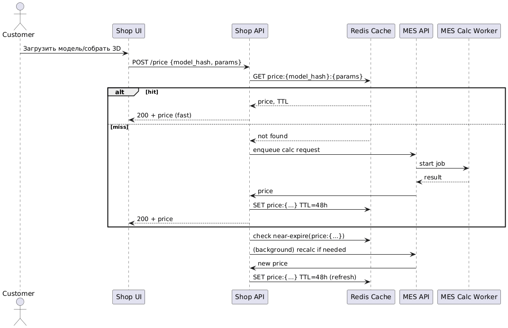

#  Кеширование в системе «Александрит»

## 1)  Мотивация

Проблемы, которые наблюдаем сейчас:
-  Долгие расчёты стоимости в MES (в среднем 2–3 минуты, до 30 минут на сложных моделях).
-  Медленная первая страница/дашборд MES со списками заказов (операторам критично видеть «самые новые»).
-  Повторные скачивания одинаковых 3D-моделей из S3.
-  Многократные чтения одних и тех же справочников/метаданных.

Цели кеширования:
- Сократить время отклика пользовательских сценариев.
- Снизить нагрузку на БД, MES и S3.
- Уменьшить общее количество «дорогих» операций (повторные расчёты стоимости и повторные чтения списков).

Компоненты, которые включаем в кеширование:
1. Результаты расчёта стоимости (ключ: `model_hash + параметры`) — самый «дорогой» кусок.
2. Списки заказов/дашборды в CRM API и MES API (ключи с параметрами фильтров/страниц).
3. Метаданные/справочники (редко меняются, часто читаются) — в Shop API/CRM API/MES API.
4. 3D-модели из S3 — HTTP-кеширование + CDN.
5. Агрегаты (счётчики «новых заказов» и др).

> операции «взять заказ в работу» и распределение задач оператором не кешируем, они консистентны и должны идти напрямую (с блокировками/транзакциями).

---

## 2) Предлагаемое решение

### 2.1 Тип кеширования
- **Серверное кеширование** (Redis Cluster) — основа для API (Shop API, CRM API, MES API).  
  Причины: контролируемые ключи/TTL, инвалидация по событиям (RabbitMQ), высокая скорость, горизонтальное масштабирование.
- **Клиентское кеширование** — для статических файлов/превью из S3 и неизменяемых публичных ресурсов:
  - HTTP headers: `Cache-Control`, `ETag`, `Last-Modified`.
  - CDN поверх S3 (для изображений/превью моделей).

### 2.2 Паттерны кеширования
| Область | Паттерн | Почему так                                                                                                         | Почему не другие |
|---|---|--------------------------------------------------------------------------------------------------------------------|---|
| Результат расчёта стоимости (Shop↔MES) | **Refresh-Ahead** + «мемоизация» по `model_hash` | Повторные расчёты дорогие; заранее продлеваем TTL для частых комбинаций параметров; при обращении — моментальный ответ | Cache-Aside может давать «холодные» промахи и долгий первый ответ; Write-Through увеличивает латентность записи и не даёт выигрыш на чтение «дорогой» функции |
| Списки заказов/дашборды | **Cache-Aside** | Классический read-heavy сценарий: сначала читаем из кеша; промах — грузим из БД и наполняем кеш; TTL малый | Write-Through неуместен для чтений, Refresh-Ahead сложнее синхронизировать с множеством комбинаций фильтров |
| Метаданные/справочники | **Cache-Aside** + длительный TTL | Редко обновляются, легко инвалидация по событию админ-панели    | Write-Through не даёт преимуществ, Refresh-Ahead избыточен |
| С3 (статик/превью) | **HTTP-кеш** (CDN, ETag) | Решает проблему повторных скачиваний на краю      | Серверный кеш не нужен: отдаёт сам CDN быстрее |

### 2.3 Стратегия инвалидации кеша
- **Временная (TTL)**:
  - Результаты расчёта: 24–72 часа (регулируется по объёму кеша и популярности).
  - Списки/дашборды: 5–30 секунд (компромисс свежесть/нагрузка).
  - Справочники: 1–24 часа (или manual invalidate).
- **По ключу (event-driven)**:
  - Любое **изменение статуса заказа** публикует событие в RabbitMQ → инвалидируем ключи:  
    - `order:{id}`  
    - `orders:list:*` (селективно по фильтрам: новые/в работе/моё)
- **Программная/селективная**:
  - Админ-панель: «Сбросить кеш справочников», «Сбросить кеш конкретного заказа/фильтра».
- **Refresh-Ahead**:
  - Джоба в фоне сканирует ключи (LRU, hit count) и продлевает TTL, пока они популярны.

---

## 3)  Диаграммы последовательности

### 3.1 Чтение списка заказов (оператор MES/продавец CRM)

### 3.2 Запись изменения статуса заказа

### 3.3 Расчёт стоимости (мемоизация + Refresh-Ahead)

---

## 4)  Сравнение стратегий кеширования/инвалидации

| Первая стратегия | Вторая стратегия | Остальные стратегии | Лучше подходит, потому что… | Позволяет сделать… |
|---|---|---|---|---|
| **Cache-Aside** (списки, справочники) | **Refresh-Ahead** (расчёт цены) | Write-Through / Write-Behind | Cache-Aside лёгкая инвалидация по ключам и TTL | Быстро разгрузить БД на чтениях |
| **Event-driven инвалидация** (по RabbitMQ) | **Короткий TTL** на списках | Полная ручная инвалидация | Убирает stale-данные сразу после изменений, но не перегружает систему | Сохранять свежесть UI операторов без постоянных промахов |
| **HTTP кеш/ETag/CDN** (S3) | — | Серверный кеш для S3 | CDN и браузерный кеш дешевле и ближе к пользователю | Сильно снижает трафик и латентность на статике |

---

## 5)  Параметры и ключи кеша

- Результаты цены: `price:{model_hash}:{params}` (TTL 24–72h, Refresh-Ahead).
- Списки заказов:  
  - `orders:list:newest:{page}`  
  - `orders:list:in_progress:{page}`  
  - `orders:list:operator:{operatorId}:{page}`  
  - TTL 5–30s + инвалидация по событию «order.status.changed».
- Заказ: `order:{id}` (TTL 30–60s) + инвалидация по событию.
- Справочники: `dict:{name}` (TTL 1–24h) + кнопка «сбросить кеш» в админке.

---

## 6) Не кешируем:

- Захват заказа оператором — только транзакции/блокировки.
- Очередь производственных задач.
- Данные, критичные к строгой консистентности (финансовые транзакции).

---

## 7)  Технологии и изменения в архитектуре

- Redis Cluster для серверного кеша.
- Фоновый сервис Refresh-Ahead (шедулер/воркер).
- CDN поверх S3 + `Cache-Control/ETag`.
- Инвалидация по RabbitMQ через консюмеры в CRM API.

---

## 8)  Риски и как их покрыть

- Stale-данные на списках: короткий TTL + event-driven инвалидация.
- Шторм кеш-промахов: warm-up ключей, ограничение QPS.
- Рост памяти Redis: LFU/LRU, TTL, мониторинг hit/miss.
- Неконсистентность данных по цене: версионирование ключей.

---

## 9)  Метрики для контроля

- Cache **hit/miss ratio** по ключевым группам.
- Среднее время ответа API до/после кеширования.
- QPS и latency расчётов MES.
- Количество инвалидаций/мин.
- Объём Redis, эвикции, промахи на списках.

---

 **Итоги**:
- Server-side Redis — ядро решения.  
- Refresh-Ahead для цены.  
- Cache-Aside для списков/справочников.  
- Event-driven инвалидация по RabbitMQ.  
- HTTP-кеш + CDN для S3.
"""

